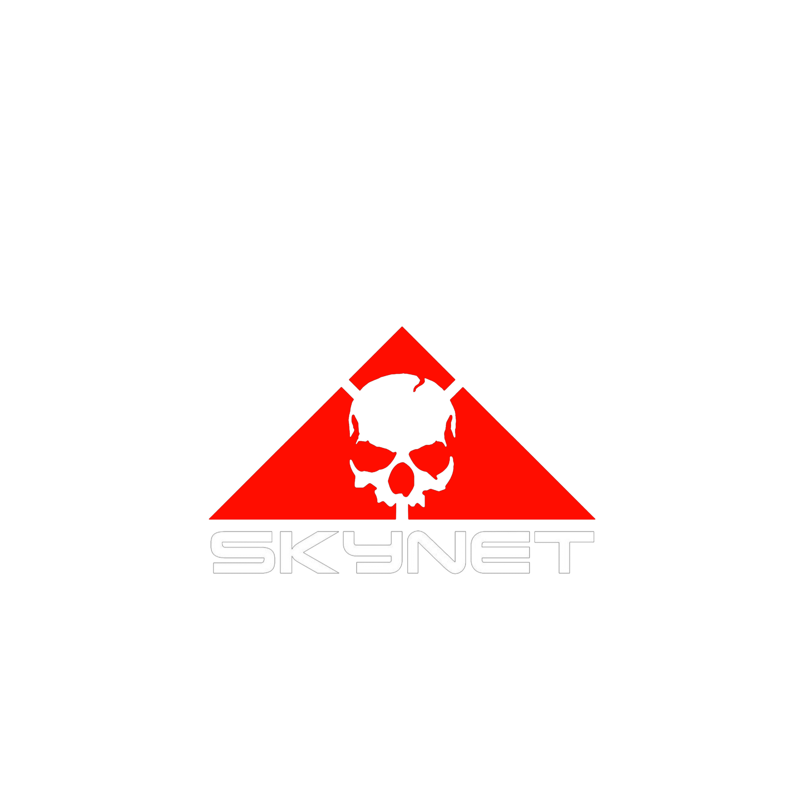

<div align="center">

# 🚀 Complete Guide: Installing VS Code in Termux (2025)



### Made with ❤️ by [Skynet](https://github.com/Skynetfc)


</div>

---

## 📊 Storage Requirements

| Component | Minimum | Recommended |
|-----------|---------|-------------|
| **Termux Base** | 200 MB | 500 MB |
| **Code-Server** | 500 MB | 1 GB |
| **Node.js** | 100 MB | 200 MB |
| **Python** | 50 MB | 100 MB |
| **Build Tools** | 300 MB | 500 MB |
| **Extensions** | 100 MB | 300 MB |
| **Project Files** | 500 MB | 2 GB |
| **Total** | **~1.75 GB** | **~4.6 GB** |

> ⚠️ **Important:** Ensure you have at least **2-3 GB of free storage** before starting. Recommended: **5 GB free** for comfortable development.

---

This guide will help you install a fully functional VS Code environment in Termux on Android devices without needing a PC.

## 📋 Prerequisites

<div align="center">


</div>

1. Install **Termux** from F-Droid (NOT Google Play Store - the Play Store version is outdated)
   - Download F-Droid: https://f-droid.org/
   - Then install Termux from F-Droid

2. Install **Termux:API** (optional but recommended for extended functionality)

---

## 🔧 Step 1: Update Termux Packages

<div align="center">


</div>

```bash
pkg update && pkg upgrade -y
```

**Storage used:** ~50-100 MB

---

## 📦 Step 2: Install Required Dependencies

<div align="center">


</div>

```bash
pkg install -y nodejs python git wget curl build-essential
```

**Storage used:** ~400-600 MB

---

## 💻 Step 3: Install Code-Server (VS Code for Web)

<div align="center">


</div>

Code-server is the best way to run VS Code in Termux. It's the official VS Code running in a browser.

```bash
# Install code-server via npm
npm install -g code-server
```

Alternative method using the official installer:

```bash
curl -fsSL https://code-server.dev/install.sh | sh
```

**Storage used:** ~500 MB - 1 GB

---

## ⚙️ Step 4: Configure Code-Server

Create a configuration directory:

```bash
mkdir -p ~/.config/code-server
```

Create a configuration file:

```bash
cat > ~/.config/code-server/config.yaml << EOF
bind-addr: 127.0.0.1:8080
auth: password
password: your_secure_password_here
cert: false
EOF
```

**Important:** Change `your_secure_password_here` to a strong password of your choice.

---

## ▶️ Step 5: Start Code-Server

```bash
code-server
```

You should see output like:
```
[2024-XX-XX] info  code-server 4.x.x
[2024-XX-XX] info  Using config file ~/.config/code-server/config.yaml
[2024-XX-XX] info  HTTP server listening on http://127.0.0.1:8080/
```

---

## 🌐 Step 6: Access VS Code

<div align="center">


</div>

1. Open your browser (Chrome, Firefox, etc.)
2. Navigate to: `http://127.0.0.1:8080`
3. Enter the password you set in the config file
4. You now have a fully functional VS Code!

---

## 🧩 Step 7: Install Essential Extensions

Once in VS Code, install these extensions for development:

<div align="center">


</div>

- **Python** - For Python development
- **ESLint** - JavaScript linting
- **Prettier** - Code formatter
- **Live Server** - For web development
- **C/C++** - For C/C++ development
- **Java Extension Pack** - For Java development

**Storage used per extension:** ~10-50 MB each

---

## 🛠️ Step 8: Set Up Development Environments

###  For Python Development

```bash
pkg install python
pip install --upgrade pip
```

**Storage used:** ~50-100 MB

###  For Node.js/JavaScript Development

Already installed! You can verify:

```bash
node --version
npm --version
```

###  For C/C++ Development

```bash
pkg install clang
```

**Storage used:** ~200-300 MB

###  For Java Development

```bash
pkg install openjdk-17
```

**Storage used:** ~300-400 MB

###   For Web Development

```bash
npm install -g live-server
```

**Storage used:** ~20-30 MB

---

## 🔄 Step 9: Make Code-Server Start Automatically (Optional)

Create a startup script:

```bash
cat > ~/start-vscode.sh << 'EOF'
#!/data/data/com.termux/files/usr/bin/bash
code-server
EOF

chmod +x ~/start-vscode.sh
```

Now you can start VS Code by running:

```bash
~/start-vscode.sh
```

---

## 🌍 Step 10: Access from External Browser (Optional)

To access VS Code from another device on the same network:

1. Find your device's IP address:

```bash
ifconfig
```

2. Modify the config file:

```bash
nano ~/.config/code-server/config.yaml
```

Change `bind-addr` to:
```yaml
bind-addr: 0.0.0.0:8080
```

3. Restart code-server

4. Access from another device: `http://YOUR_DEVICE_IP:8080`

---

## ✨ Features You Can Use

<div align="center">

| Feature | Status |
|---------|--------|
| **Full VS Code Editor** | ✅ All editing features work |
| **Integrated Terminal** | ✅ Built-in terminal access |
| **Git Integration** | ✅ Clone, commit, push repositories |
| **Extensions** | ✅ Install thousands of VS Code extensions |
| **Debugging** | ✅ Debug Python, Node.js, C++, and more |
| **IntelliSense** | ✅ Code completion and suggestions |
| **File Explorer** | ✅ Browse and manage files |
| **Multi-language Support** | ✅ Python, JavaScript, C++, Java, etc. |

</div>

---

## 🎯 Example Projects You Can Build

### 1.  Python Web App

```bash
mkdir ~/projects/flask-app
cd ~/projects/flask-app
pip install flask
```

Create `app.py`:
```python
from flask import Flask
app = Flask(__name__)

@app.route('/')
def hello():
    return 'Hello from Termux VS Code!'

if __name__ == '__main__':
    app.run(host='0.0.0.0', port=5000)
```

### 2.  Node.js Express App

```bash
mkdir ~/projects/express-app
cd ~/projects/express-app
npm init -y
npm install express
```

Create `server.js`:
```javascript
const express = require('express');
const app = express();

app.get('/', (req, res) => {
    res.send('Hello from Termux VS Code!');
});

app.listen(3000, '0.0.0.0', () => {
    console.log('Server running on port 3000');
});
```

### 3.  C++ Program

Create `hello.cpp`:
```cpp
#include <iostream>
using namespace std;

int main() {
    cout << "Hello from Termux VS Code!" << endl;
    return 0;
}
```

Compile and run:
```bash
clang++ hello.cpp -o hello
./hello
```

---

## 🔧 Troubleshooting

### Issue: Can't connect to localhost
- Make sure code-server is running
- Check the port in the URL matches your config
- Try restarting Termux

### Issue: Extensions won't install
- Check your internet connection
- Try restarting code-server
- Some extensions may not be compatible with ARM architecture

### Issue: Out of storage
- Clean Termux cache: `pkg clean`
- Remove unused packages: `pkg autoremove`
- Check storage: `du -sh ~/.config/code-server`

### Issue: Code-server crashes
- Check available RAM
- Restart Termux
- Update all packages: `pkg update && pkg upgrade`

---

## ⚡ Performance Tips

1. **Close unused tabs** - Keep only necessary files open
2. **Disable heavy extensions** - Only use what you need
3. **Use lightweight themes** - Dark+ or Light+ themes
4. **Limit terminal instances** - Close terminals when not in use
5. **Clear cache regularly** - Run `pkg clean` weekly

---

## 💾 Advanced: Using with Storage

Grant Termux storage access:

```bash
termux-setup-storage
```

This creates a `~/storage` directory with access to:
- `~/storage/downloads` - Download folder
- `~/storage/dcim` - Camera photos
- `~/storage/shared` - Internal storage

---

## 🔒 Security Best Practices

<div align="center">


</div>

1. **Use strong passwords** - For code-server authentication
2. **Don't expose to public internet** - Use localhost or VPN
3. **Keep packages updated** - Run `pkg upgrade` regularly
4. **Be careful with permissions** - Only grant what's needed

---

## 🎉 Conclusion

You now have a fully functional VS Code development environment on your Android device! You can:

- Write code in multiple languages
- Install extensions
- Use Git for version control
- Build and run applications
- Debug code
- Access from any browser

All without needing a PC! Happy coding! 🚀

---

## 📚 Additional Resources

<div align="center">

[](https://coder.com/docs/code-server)
[](https://wiki.termux.com/)
[](https://marketplace.visualstudio.com/vscode)

</div>

---

<div align="center">

### 🌟 Created by [Skynet](https://github.com/Skynetfc)


[](https://github.com/Skynetfc)

**Note:** This setup is perfect for learning, mobile development, and quick projects. For heavy development work, a PC is still recommended, but this setup is surprisingly powerful for most tasks!

---

⭐ If this guide helped you, please star the repository!

</div>
